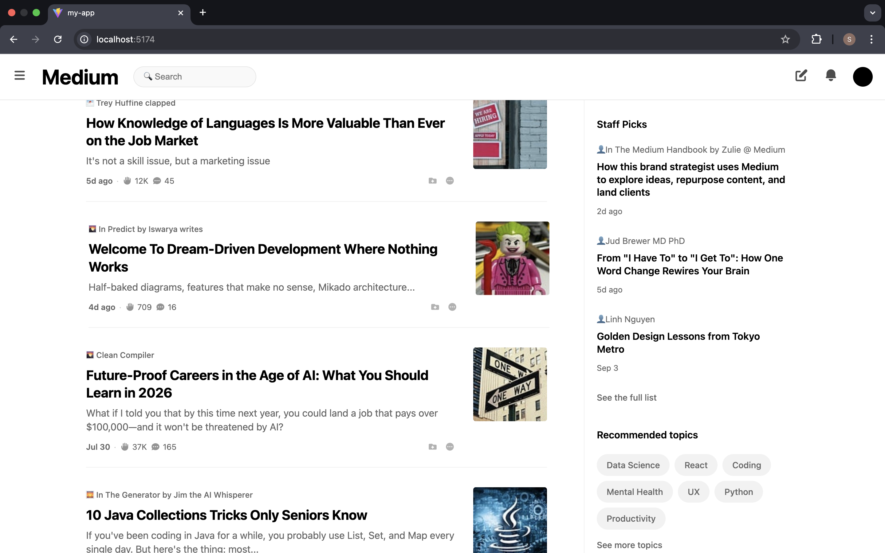
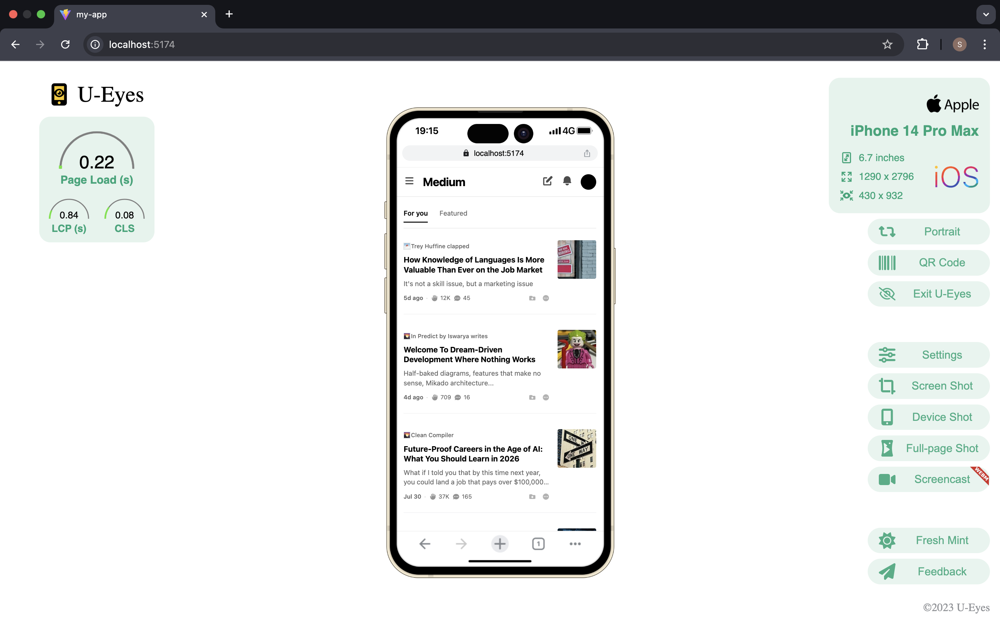

# Medium Clone – Frontend Engineering Assessment

A responsive, high-fidelity replica of Medium’s homepage built with **React** and **Styled Components** for the **Korna Frontend Engineer assessment**.

## 🚀 Overview
This project recreates Medium’s homepage with attention to visual accuracy, responsiveness, and clean component architecture across mobile, tablet, and desktop breakpoints.

## 🛠️ Tech Stack
- **React 18**
- **Vite**
- **Styled Components**
- **React Icons**

## ✅ Key Features
- High-fidelity UI replica  
- Responsive (mobile-first)  
- Pixel-perfect components  
- Optimized layouts for mobile, tablet, and desktop

### 📱 Responsive Layouts
- **Mobile (≤768px):** Single-column layout, sidebar moves below articles  
- **Tablet (769–1023px):** Two-column layout  
- **Desktop (≥1024px):** Optimized wide layout

## 📁 Project Structure

src/
├── components/
│   ├── Header/
│   ├── ArticleCard/
│   ├── Sidebar/
│   ├── StaffPicks/
│   ├── TopicsSection/
│   └── FollowSection/
├── data/
│   └── mockData.js
├── App.jsx
├── App.css
└── main.jsx

##  ✅ Prerequisites
- **Node.js (v16+)**
- **npm or yarn**

## ✅ Installation

 ## git clone <https://github.com/shittu-qudus/korna>
- **cd my-app**
- **npm install**
- **npm run dev**

Open in browser:
http://localhost:5173
✅ Available Scripts

## 🧩 Technical Choices
- **Mobile-first media queries**
- **Scoped styling with Styled Components**
- **Reusable, modular components**

## ✅ Assumptions
- **Articles prioritized over sidebar on mobile**
- **Larger touch targets and proper spacing**
- **Progressive enhancement approach**
- **Lazy-loading considered in structure**

## 📏 Breakpoints
- **Mobile: ≤ 768px**
- **Tablet: 769–1023px**
- **Desktop: ≥ 1024px**

## 🚀 Deployment
- **Deployed on Vercel:**
- **[Live Demo Link] (https://korna.vercel.app/)**
- **To create a production build:**
## npm run build

## 📝 Additional Notes
- **Visual implementation prioritized over functionality**
- **Optimized for modern browsers**
- **Semantic HTML for accessibility**
- **Efficient rendering and styling practices**
- **most of icon/small coundn't be extracted,emoji was used to replace them**

### Contact & Submission Info

**Developer:** SHITTU QUDUS A  
**Email:** [shittuqadekunle@gmail.com](mailto:shittuqadekunle@gmail.com)  
**GitHub:** [shittu-qudus](https://github.com/shittu-qudus)

**Assessment For:** Korna - Frontend Engineer Position  
**Submission Date:** September 2025  

